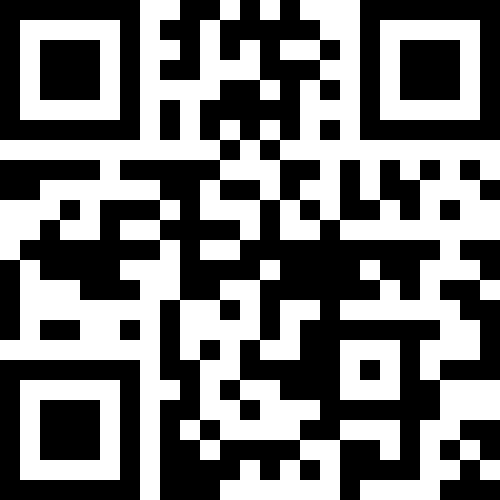
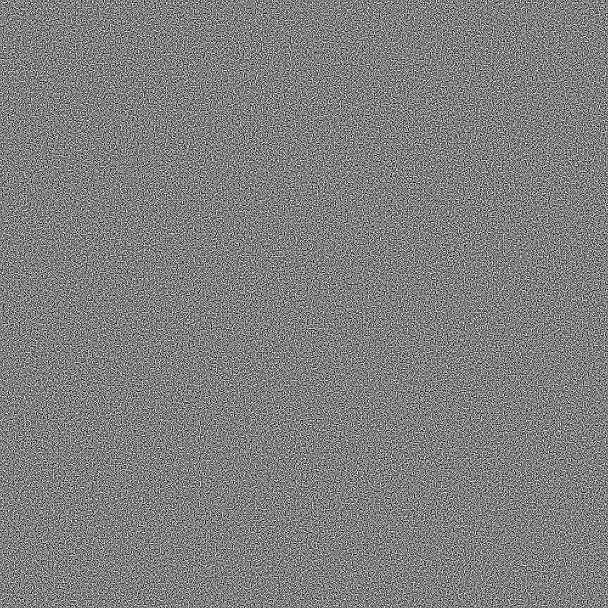
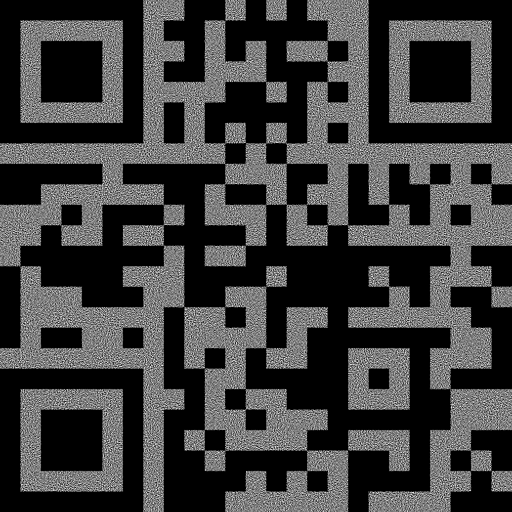

# 👀 Visual cryptography

## ℹ️ O programie

#### [🇬🇧 English version](#ℹ️-about-the-program)

### ❔ Co to jest kryptografia wizualna

Kryptografia wizualna polega na bezpiecznym szyfrowaniu informacji takich jak tekst czy obrazy. Odszyfrować dane można wyłącznie za pomocą wzroku. Algorytm Naora i Shamira polega na podzieleniu czarno-białego obrazka na udziały, drukowane na przezroczystych foliach. Pojedynczy udział nie niesie żadnej informacji, ale po nałożeniu udziałów na siebie można odczytać informację. Każdy piksel dzielony jest na cztery, a wybór kombinacji, która będzie na obu udziałach zależy od koloru piksela.

### 💻 Uruchomienie i działanie programu

Windows:

* `> python vis_crypto.py "name.png"` <- `name.png` jest nazwą czarno-białego obrazka

Linux:

* `> python3 vis_crypto.py "name.png"` <- `name.png` jest nazwą czarno-białego obrazka

Program sprawdza poprawność obrazka, następnie dzieli każdy piksel na 4 fragmenty i generuje 2 udziały. Jednocześnie łączy je ponownie. Wynikiem działania programu są 3 nowe obrazki, 2 udziały i ich połączenie.

### [📷 Przykład działania](#example)

## ℹ️ About the program

#### [🇵🇱 Wersja polska](#ℹ️-o-programie)

### ❔ What is visual cryptography

Visual cryptography allows secure encryption of visual data (text or images) in such a way that*only human vision is required to decrypt it. The Naor-Shamir scheme splits a black-and-white image into shares printed on transparent sheets. A single share reveals nothing, but stacking them reveals the original image. Each pixel is divided into 4 subpixels, and the pattern chosen for each share depends on whether the original pixel was black or white.

### 💻 Running the program

Windows:

* `> python vis_crypto.py "name.png"` <- where `name.png` is the name of a black-and-white image

Linux:

* `> python3 vis_crypto.py "name.png"` <- where `name.png` is the name of a black-and-white image

The program validates the input image, splits each pixel into 4 subpixels, and generates 2 shares. It also automatically stacks them together. As output, it produces 3 images: both shares and their combination.

### 📷 Example output

  

  
  

  

